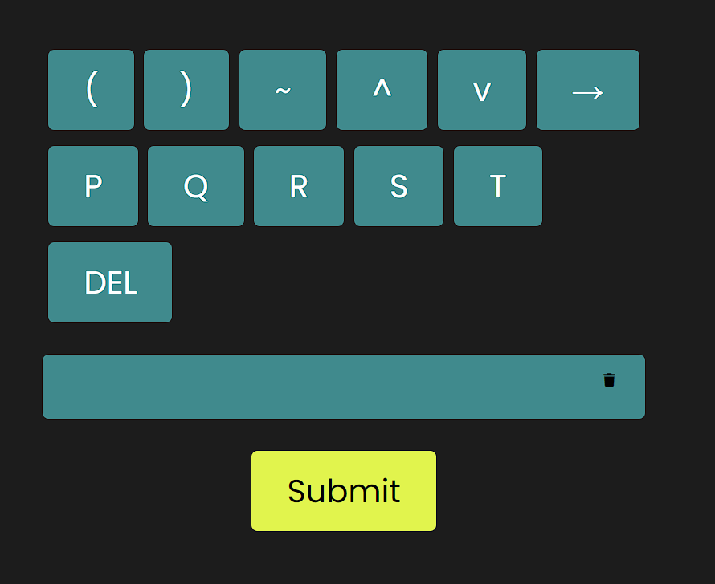
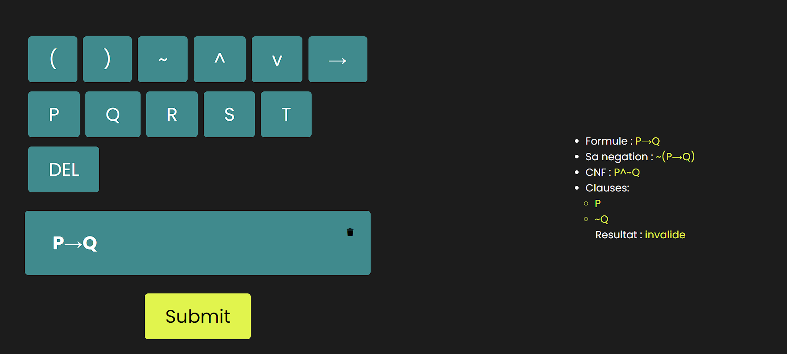

# The resolution Algorithm in artificial intelligence 

## Introduction

This project implements the resolution algorithm from scratch.

Given a valid propositional logic expression, the algorithm does the following:

1. Applying parenthesis to impose precedence.
2. Parsing the expression into a manageable json object.
3. Transforming the negation of the expression into CNF (conjective normal form)
4. Splitting the result into valid clauses
5. Applying the resolution algorithm, by selecting valid pair of clauses iterativly

The resolution rule states that if there exist two clauses, one containing a literal L and another containing the negation of that literal ¬L, then their resolvent can be derived by removing L and ¬L from the respective clauses and combining the remaining literals.

After applying the resolution rule, a new clause is generated containing all the literals from the two original clauses except for the complementary literals that were resolved. This new clause is added to the set of existing clauses.

We stop the resolution algorithm when we either detect a contradiction (empty clause) or no new clauses can be generated.

In our case, since we started with the negation of our input (statement), reaching the empty clause means the statement is `satisfiable`. Otherwise it is not.

6. Displaying the result in a user-friendly interface.


## 1 - Applying parenthesis to impose precedence.

To explain this part, let's walk through an example:
- P → Q ^ S
  
  This should be interpreted as:
- P → (Q ^ S) and not as (P → Q) ^ S
  
To implement such concept, I used a technique called `Full parenthesization`, which is a technique used in the early FORTRAN compiler. It's a simple operator parsing algorithm that inserts a number of parentheses around each operator.

Here is the correspondence table:

```javascript
  const preced = {
    "^": ")^(",
    v: "))v((",
    "→": "))→((",
    "(": "((",
    ")": "))",
  };
```

Each operator in the `key` would be replaced with its equivalent in the `value`. And we wrap the whole expression with `(( ))`

Applying this algorithm to our expression, we get:
- (( P ))→(( Q )^( S )) which respects precedence.


## 2- Parsing the statement

I implemented a recursive parser that, given a statement as a string, for example `P ^ ~Q`, transforms it into a javascript object:

```json
{
    "type" : "CONJUNCTION",
    "left": {
            "type": "VARIABLE",
            "name" : "P"
    },
    "right" : {
            "type" : "NEGATION",
            "formula" : {
                "type" : "VARIABLE",
                "name": "Q"
            }
    }
}
```
This step is necessary, so that we can handle and transform the expressions recursively and in an easy way.

## 3- CNF (Conjunctive Normal Form)

```
    Expression is CNF if : 
    - It is an atom : P,Q,S...
    - It is a negation of atom : ~P , ~Q , ~S ...

    - Formula is of DISJONCTION type
      - Left part is either : atom | negation of atom | DISJONCTION
      - Right part is either :  atom | negation of atom | DISJONCTION

    - Formula is of CONJUNCTION type
      - Left part is either a valid CNF, or a valid DISJONCTION
      - Right part is either a valid CNF, or a valid DISJONCTION

```

Following these rules, I implemented a function, that given a parsed formula, we get a cnf formula in return.

### 4- Stringifying the formula and Extracting Clauses

For this part, I implemented a function that takes a parsed formula, and transforms it back to a string.

Then I remove all parenthesis, and split the string by the operator `^`.

This gives us an array of Clauses.

## 5- Resolution algorithm

For this part, I implemented the algorithm in my own style.

Let's walk throu an example. Let's say our clauses are :
- ~P
- Q
- P

First, I initialize an empty javascript object:

```javascript
    {

    }
```

I iterate over the clauses and I do the following:
- If the current atom doesnt exist in the map, set it to `1`.
- If the current atom exists in the map, `increment` its value by `1`.
- If the current atom is a negation, and the atom doesnt exists in the map, set it to `-1`.
- If the current atom is a negation, and the atom exists in the map, `decrement` its value by `1`
- If all values are `0` at the end, our Expression is `valid`

First iteration
```javascript
    {
        "P" : -1
    }
```
Second iteration
```javascript
    {
        "P" : -1,
        "Q" : 1
    }
```
Last iteration
```javascript
    {
        "P" : 0,
        "Q" : 1
    }
```

Since Q has `1`, the result is `invalid` or `unsatisfiable` expression.


# 6- Displaying the result in a user-friendly interface

I implemented a user-friendly interface to interact with the algorithm.

The user can use the predisposed keys, or they can use their own keyboard to input a statement.



Once the user constructs their statement, they can submit the input, and get the results.

